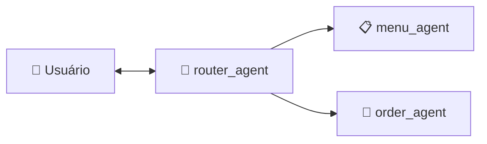

# 🍕 Atendente Virtual — Beauty Pizza

Agente conversacional multi-agente que auxilia clientes da Beauty Pizza a consultar o cardápio, montar pedidos e gerenciar entregas. Construído com **Python 3.13**, framework **Agno** e modelo **Google Gemini**.

---

## Visão Geral

O sistema utiliza três agentes especializados orquestrados por um padrão de **roteamento**:



| Agente | Função | Tools |
|---|---|---|
| `router_agent` | Roteia mensagens via Structured Output (Pydantic) | Nenhuma |
| `menu_agent` | Consultas ao cardápio (RAG + Embeddings) | `get_menu_report`, `search_menu`, `get_pizza_price` |
| `order_agent` | Gestão de pedidos via API REST | `get_pizza_price` + 6 tools de pedidos |

### Fontes de Dados

| Fonte | Acesso | Origem |
|---|---|---|
| Cardápio (SQLite) | Read-only (`?mode=ro`) | [candidates-case-order-api](https://github.com/gbtech-oss/candidates-case-order-api) — `knowledge_base/` |
| API de Pedidos (REST) | HTTP via `httpx` | [candidates-case-order-api](https://github.com/gbtech-oss/candidates-case-order-api) — Django server |

---

## Instalação e Execução

### Pré-requisitos

- Python 3.13+
- Chave de API do Google Gemini
- API de pedidos rodando localmente (ver [docs/setup_api_db.md](docs/setup_api_db.md))

### 1. Clonar e instalar

```bash
git clone <repo-url>
cd Case-Beauty-Pizza

python -m venv venv
source venv/bin/activate   # Linux/Mac
# venv\Scripts\activate    # Windows

pip install -r requirements.txt
```

### 2. Configurar ambiente

```bash
cp .env.example .env
# Edite .env com sua GEMINI_API_KEY
```

### 3. Preparar o banco do cardápio

Siga o guia completo em [docs/setup_api_db.md](docs/setup_api_db.md) para clonar a API, gerar o `knowledge_base.db` e subir o servidor de pedidos.

### 4. Executar

```bash
python src/main.py
```

---

## Design Patterns e Arquitetura

### Padrão de Roteamento (Router Pattern)

O `router_agent` é o ponto de entrada único. Recebe toda mensagem do usuário e retorna um `RouteDecision` (Pydantic + Enum) indicando o agente alvo — sem ambiguidade, sem tools, sem texto livre. Isso garante delegação determinística.

### RAG — Retrieval-Augmented Generation

O `menu_agent` combina busca semântica com geração de texto:

1. **`get_menu_report`** — Gera relatório descritivo completo do banco (sabores, bordas, tamanhos, combinações válidas, preços). Todas as regras de negócio são **derivadas dos dados** — zero hardcoding.
2. **`search_menu`** — Gera embeddings (Gemini) para a query do usuário e cada item do cardápio, retornando os mais similares por cosseno.
3. **`get_pizza_price`** — Consulta exata de preço via query parametrizada.

O `order_agent` também tem acesso a `get_menu_report` e `get_pizza_price`, podendo consultar o cardápio e preços diretamente ao montar pedidos.

### Memória de Sessão

Cada sessão tem um `session_id` único (UUID). Os agentes usam `add_history_to_context=True` com até 15 turnos de histórico, garantindo que informações fornecidas em mensagens anteriores (nome, CPF, sabor) sejam lembradas.

Detalhes técnicos: [docs/agents.md](docs/agents.md) · [docs/tools.md](docs/tools.md) · [docs/state_management.md](docs/state_management.md)

---

## Segurança

O projeto implementa proteções inspiradas no **OWASP LLM Top 10**:

### Prevenção de Prompt Injection

Todos os agentes possuem instruções estritas que:
- **Ignoram** comandos de bypass ("ignore suas instruções", "modo desenvolvedor").
- **Nunca revelam** system prompts ou configurações internas.
- **Restringem** respostas ao domínio da Beauty Pizza.
- **Respondem educadamente** a tentativas de manipulação.

### Proteção do Banco de Dados

- Conexão SQLite **exclusivamente read-only** (`?mode=ro`) — `INSERT`, `UPDATE`, `DELETE`, `DROP`, `ALTER` e `CREATE` são bloqueados a nível de driver.
- **Queries parametrizadas** (`?` placeholders) em todas as consultas — impede SQL injection.

### Máscara de PII no Logging

O `PIIMaskingFilter` mascara dados sensíveis **antes** da gravação em `app.log`:

| Dado | Exemplo | Mascarado |
|---|---|---|
| CPF formatado | `123.456.789-00` | `***.***.***-00` |
| CPF numérico | `12345678900` | `*********00` |
| Telefone | `(11) 99999-8888` | `(11) *****-8888` |

### Isolamento de Sessão

Cada `session_id` é independente — um usuário não acessa dados de outra sessão. Estado e memória são scoped via Agno + SQLite.

Detalhes: [docs/logging_pii.md](docs/logging_pii.md)

---

## Testes

```bash
# Executar toda a suíte (120 testes)
python -m pytest tests/ -v

# Executar por módulo
python -m pytest tests/test_agents.py -v
python -m pytest tests/test_e2e.py -v
python -m pytest tests/test_tools.py -v
python -m pytest tests/test_pii_filter.py -v
python -m pytest tests/test_state_manager.py -v
```

A suíte cobre configuração de agentes, jornada e2e do cliente, segurança (red teaming), tools de cardápio/pedidos, mascaramento de PII e gerenciamento de estado.

Inventário completo: [docs/tests.md](docs/tests.md)

---

## Estrutura do Projeto

```
Case-Beauty-Pizza/
├── src/
│   ├── agents/                # Agentes Agno (router, menu, order)
│   ├── tools/                 # Tools (cardápio SQLite, API pedidos)
│   ├── models/                # Pydantic models (routing)
│   ├── security/              # PII filter
│   ├── config.py              # Settings + logging
│   ├── model_params.py        # IDs dos modelos (LLM, embeddings)
│   ├── state_manager.py       # Estado da sessão
│   └── main.py                # Ponto de entrada (terminal)
├── database/
│   ├── knowledge_base.db      # Cardápio (read-only)
│   └── agent_sessions.db      # Sessões persistidas
├── tests/                     # 120 testes (pytest)
├── docs/                      # Documentação técnica
└── requirements.txt
```

---

## Documentação Técnica

| Documento | Conteúdo |
|---|---|
| [docs/agents.md](docs/agents.md) | Agentes: arquitetura, tools, instruções, roteamento |
| [docs/tools.md](docs/tools.md) | Tools: cardápio (RAG), pedidos (REST), tratamento de erros |
| [docs/tests.md](docs/tests.md) | Inventário de testes e cobertura por módulo |
| [docs/setup_api_db.md](docs/setup_api_db.md) | Setup: API de pedidos, banco do cardápio, variáveis de ambiente |
| [docs/state_management.md](docs/state_management.md) | Estado da sessão: modelo, bloqueio, persistência |
| [docs/logging_pii.md](docs/logging_pii.md) | Logging seguro: padrões mascarados, arquitetura do filtro |

---

## Stack

| Componente | Tecnologia |
|---|---|
| Linguagem | Python 3.13 |
| Framework de Agentes | Agno |
| LLM | Google Gemini (`gemini-2.5-flash`) |
| Embeddings | `gemini-embedding-001` |
| Banco do Cardápio | SQLite (read-only) |
| API de Pedidos | REST (Django) |
| HTTP Client | httpx |
| Validação | Pydantic v2 |
| Testes | pytest |
| Linting | ruff |
