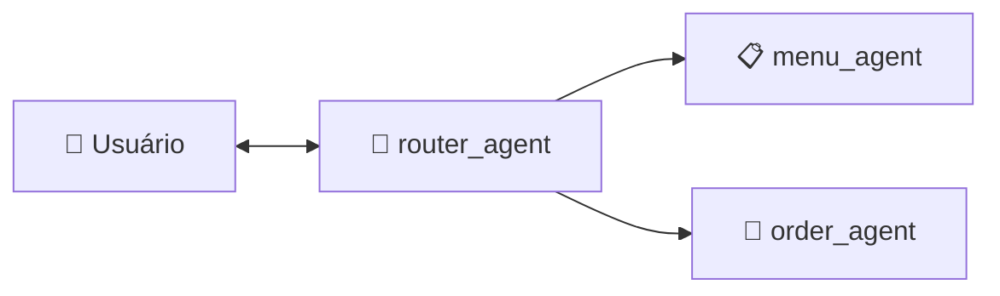

# Atendente Virtual — Beauty Pizza

Sistema conversacional de multi-agentes, que auxilia clientes da Beauty Pizza a consultar o cardápio e fazer pedidos.

Construído com **Python 3.13**, framework **Agno** e modelo **Google Gemini**.

---

## Visão Geral

O sistema utiliza três agentes especializados e orquestrados por um padrão de **roteamento**:



| Agente | Função | Tools |
|---|---|---|
| `router_agent` | Roteia mensagens via Structured Output (Pydantic) | Nenhuma |
| `menu_agent` | Consultas ao cardápio (RAG + Embeddings) | `get_menu_report`, `search_menu`, `get_pizza_price` |
| `order_agent` | Gestão de pedidos via API REST | `get_pizza_price` + 6 tools de pedidos |

---

## Fontes de Dados

| Fonte | Acesso | Origem |
|---|---|---|
| Cardápio (SQLite) | Read-only (`?mode=ro`) | [candidates-case-order-api](https://github.com/gbtech-oss/candidates-case-order-api) — `knowledge_base/` |
| API de Pedidos (REST) | HTTP via `httpx` | [candidates-case-order-api](https://github.com/gbtech-oss/candidates-case-order-api) — Django server |

---

## Documentações Técnicas

| Título | Arquivo |
|---|---|
| Banco de Dados e API de Pedidos | [docs/SETUP_API_DB.md](docs/SETUP_API_DB.md) |
| Arquitetura dos Agentes | [docs/AGENTIC_DESIGN.md](docs/AGENTIC_DESIGN.md) |
| Princípios de Segurança | [docs/SECURITY.md](docs/SECURITY.md) |
| Testes Automatizados | [docs/TEST_AUTO.md](docs/TEST_AUTO.md) |
| Testes - User Stories | [docs/TEST_SCENARIOS.md](docs/TEST_SCENARIOS.md) |

---

## Instalação e Execução

### Pré-requisitos

- Python 3.13
- Chave de API do Google Gemini
- API de pedidos e banco de dados rodando localmente (ver [docs/SETUP_API_DB.md](docs/SETUP_API_DB.md))

### 1. Clonar e instalar

```bash
git clone <repo-url> Case-Beauty-Pizza
cd Case-Beauty-Pizza
```
```bash
python3.13 -m venv venv
source venv/bin/activate
```
```bash
pip install --upgrade pip
pip install -r requirements.txt
```

### 2. Configurar ambiente

```bash
cp .env.example .env
# Edite .env com sua GOOGLE_API_KEY
```

### 3. Preparar API de pedidos e banco do cardápio

Siga o guia completo em [docs/SETUP_API_DB.md](docs/SETUP_API_DB.md). Garanta que a API de pedidos esteja rodando localmente em `http://localhost:8000` e que o banco SQLite do cardápio esteja em `database/knowledge_base.db`.

### 4. Executar

Para iniciar o atendente virtual, execute:
```bash
python src/main.py
```

### Testes

Para rodar a suíte completa de testes automatizados (pytest), execute:

```bash
python -m pytest tests/ -v
```

A suíte cobre configuração de agentes, jornada e2e do cliente, segurança (red teaming), tools de cardápio/pedidos e mascaramento de PII.

Inventário completo: [docs/TEST_AUTO.md](docs/TEST_AUTO.md)

---

## Estrutura do Projeto

```
Case-Beauty-Pizza/
├── src/
│   ├── agents/                # Agentes Agno (router, menu, order)
│   ├── tools/                 # Tools (cardápio SQLite, API pedidos)
│   ├── models/                # Pydantic models (routing)
│   ├── security/              # PII filter
│   ├── config.py              # Settings + logging
│   ├── model_params.py        # IDs dos modelos (LLM, embeddings)
│   └── main.py                # Ponto de entrada (terminal)
├── database/                  # (Será preenchido ao longo do setup)
│   ├── knowledge_base.db      # Cardápio (read-only)
│   ├── knowledge_base.sql     # Script para gerar o banco do cardápio
│   ├── agent_sessions.db      # Sessões persistidas
│   └── agent_logs.log         # Logs dos agentes
├── tests/                     # Testes (pytest)
├── docs/                      # Documentações técnicas
├── .env.example               # Exemplo de variáveis de ambiente
├── README.md                  # Documentação geral do projeto
└── requirements.txt           # Dependências do projeto
```

---

## Stack

| Componente | Tecnologia |
|---|---|
| Linguagem | Python 3.13 |
| Framework de Agentes | Agno |
| LLM | Google Gemini (`gemini-2.5-flash`) |
| Embeddings | `gemini-embedding-001` |
| Banco do Cardápio | SQLite (read-only) |
| API de Pedidos | REST (Django) |
| HTTP Client | httpx |
| Validação | Pydantic v2 |
| Testes | pytest |
| Linting | ruff |
