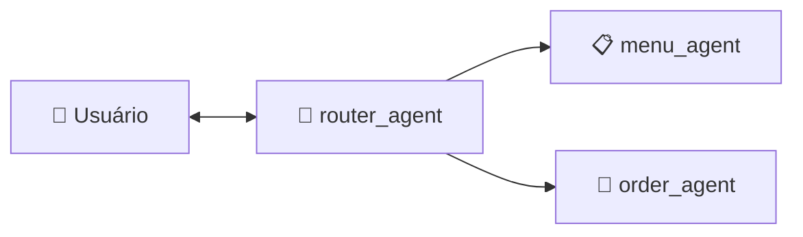

# Arquitetura dos Agentes

Nesse sistema, foi utilizado o padrão de **roteamento centralizado** com agentes especializados:

## 1. `router_agent`

O `router_agent` é o ponto de entrada único. Recebe toda mensagem do usuário e retorna um `RouteDecision` (Pydantic + Enum) indicando o agente alvo — sem ambiguidade, sem tools, sem texto livre. Isso garante uma delegação determinística.

> Código-fonte do agente: [src/agents/router_agent.py](/src/agents/router_agent.py)

## 2. `menu_agent`

Especialista em cardápio, responde exclusivamente a consultas sobre sabores, tamanhos, bordas e preços. Usa RAG (Retrieval Augmented Generation) para gerar respostas completas a partir do banco SQLite, sem hardcoding de regras.

> Código-fonte do agente: [src/agents/menu_agent.py](/src/agents/menu_agent.py)

O `menu_agent` combina busca semântica com geração de texto:

1. **`get_menu_report`** — Gera relatório descritivo completo do banco (sabores, bordas, tamanhos, combinações válidas, preços). Todas as regras de negócio são **derivadas dos dados** — zero hardcoding.
2. **`search_menu`** — Gera embeddings (Gemini) para a query do usuário e cada item do cardápio, retornando os mais similares por cosseno.
3. **`get_pizza_price`** — Consulta exata de preço via query parametrizada.

> Código-fonte das tools: [src/tools/menu_tools.py](/src/tools/menu_tools.py)

## 3. `order_agent`

Gerencia a jornada de pedidos via API REST. Tem acesso a tools para criar pedidos, adicionar itens, definir endereço e consultar status. O `order_agent` é o único responsável por interações relacionadas a pedidos. Consultas sobre o cardápio são redirecionadas automaticamente para o `menu_agent` pelo router.

> Código-fonte do agente: [src/agents/order_agent.py](/src/agents/order_agent.py)

As tools do `order_agent` cobrem todo o ciclo de vida do pedido:

1. **`create_order`** — Cria um novo pedido na API REST com nome, CPF e data de entrega.
2. **`add_items_to_order`** — Adiciona itens (pizzas) a um pedido existente, enviando nome completo, quantidade e preço unitário.
3. **`remove_item_from_order`** — Remove um item específico de um pedido pelo ID do item.
4. **`update_delivery_address`** — Atualiza o endereço de entrega (rua, número, complemento, ponto de referência).
5. **`get_order_details`** — Consulta os detalhes completos de um pedido, incluindo itens, endereço e preço total.
6. **`filter_orders`** — Busca pedidos por documento do cliente e/ou data de entrega.
7. **`get_pizza_price`** — Consulta o preço exato de uma combinação sabor + tamanho + borda no banco do cardápio (compartilhada com o `menu_agent`).

> Código-fonte das tools: [src/tools/order_tools.py](/src/tools/order_tools.py)

## Memória de Sessão

Cada sessão tem um `session_id` único (UUID). Os agentes usam `add_history_to_context=True` com até 15 turnos de histórico, garantindo que informações fornecidas em mensagens anteriores (nome, CPF, sabor) sejam lembradas.