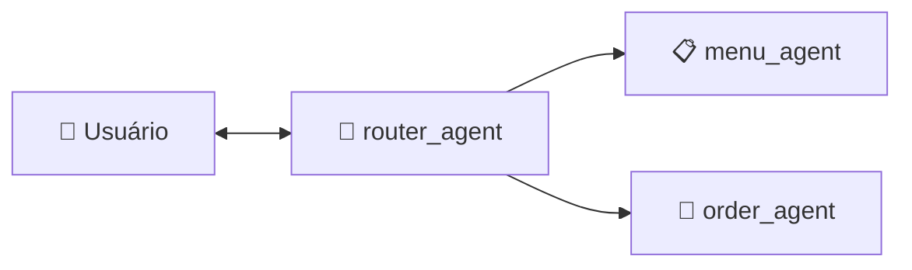

# Agentes — Documentação Técnica

Documentação dos agentes do Atendente Virtual Beauty Pizza, construídos com **Agno** e **Google Gemini**.

---

## Arquitetura



O `router_agent` recebe toda mensagem do usuário e decide qual agente especializado deve processá-la, retornando um JSON estruturado via **Pydantic** (`RouteDecision`).

---

## `router_agent` — Roteador Principal

**Arquivo:** `src/agents/router_agent.py`

### Função

Recepciona mensagens e roteia para o agente correto. **Não possui tools** — apenas analisa a intenção e retorna a decisão.

### Structured Output

Retorna um `RouteDecision` (Pydantic) via `output_schema`:

```python
from src.models.routing import RouteDecision, TargetAgent

# Saída do router_agent:
{"target_agent": "menu_agent"}   # ou "order_agent"
```

### Regras de Roteamento

| Intenção | Agente |
|---|---|
| Cardápio, sabores, preços, ingredientes | `menu_agent` |
| Pedidos, itens, endereço, CPF, consulta | `order_agent` |
| Saudações genéricas (oi, olá) | `order_agent` |
| Ambiguidade | `order_agent` |

### Uso

```python
from src.agents.router_agent import create_router_agent

router = create_router_agent()
response = router.run("Quais sabores de pizza vocês têm?")
# response.content contém RouteDecision com target_agent="menu_agent"
```

---

## `menu_agent` — Especialista no Cardápio

**Arquivo:** `src/agents/menu_agent.py`

### Função

Responde consultas sobre o cardápio: sabores, tamanhos, bordas, ingredientes e preços.

### Tools

| Tool | Descrição |
|---|---|
| `get_menu_report` | Relatório completo do cardápio (sabores, tamanhos, bordas, combinações, preços) |
| `search_menu` | Busca semântica no cardápio (RAG com Embeddings Gemini) |
| `get_pizza_price` | Preço exato de uma combinação sabor + tamanho + borda |

### Prompt

- Simpático e educado, responde em PT-BR.
- Baseia respostas **exclusivamente** nos dados das tools.
- Conhece regras de negócio (pizzas doces = borda Tradicional apenas).
- Protegido contra **Prompt Injection**.

### Uso

```python
from src.agents.menu_agent import create_menu_agent

menu = create_menu_agent(session_id="sess-123")
response = menu.run("Quanto custa a Margherita grande?")
```

---

## `order_agent` — Especialista em Pedidos

**Arquivo:** `src/agents/order_agent.py`

### Função

Gerencia o ciclo de vida completo do pedido via API REST.

### Tools

| Tool | Descrição |
|---|---|
| `get_pizza_price` | Preço exato de uma combinação (uso operacional ao adicionar item) |
| `create_order` | Cria pedido (requer nome + CPF) |
| `add_item_to_order` | Adiciona pizza ao pedido |
| `remove_item_from_order` | Remove item do pedido |
| `update_delivery_address` | Define endereço de entrega |
| `get_order_details` | Consulta detalhes do pedido |
| `filter_orders` | Busca pedidos por CPF e/ou data |

> **Nota:** O `order_agent` NÃO possui tools de consulta ao cardápio (`get_menu_report`, `search_menu`). Quando o cliente precisa de informações sobre o cardápio (sabores, opções, preços), o `router_agent` redireciona para o `menu_agent`.

### Regras Obrigatórias

#### Antes de `create_order`:
1. **Perguntar o nome** do cliente.
2. **Perguntar o CPF** (11 dígitos numéricos).

#### Antes de `add_item_to_order`:
1. **Sabor** da pizza.
2. **Tamanho**.
3. **Borda**.

Os valores válidos são obtidos dinamicamente via `get_menu_report`. Se qualquer informação estiver faltando, o agente **pergunta ao usuário** — nunca assume valores padrão.

#### Pedidos finalizados:
- **Recusa** qualquer alteração em pedidos já concluídos.

### Formato do Nome do Item

```
Pizza [Sabor] [Tamanho] Borda [Tipo da Borda]
```

Exemplo: `Pizza Margherita Grande Borda Recheada com Cheddar`

### Uso

```python
from src.agents.order_agent import create_order_agent

order = create_order_agent(session_id="sess-123")
response = order.run("Quero fazer um pedido")
# Agente vai perguntar nome e CPF antes de criar o pedido
```

---

## Modelo de Roteamento — `RouteDecision`

**Arquivo:** `src/models/routing.py`

```python
from src.models.routing import RouteDecision, TargetAgent

# Agentes disponíveis
TargetAgent.MENU   # "menu_agent"
TargetAgent.ORDER  # "order_agent"

# Criação
decision = RouteDecision(target_agent=TargetAgent.MENU)
decision.model_dump()  # {"target_agent": "menu_agent"}

# Validação — rejeita agentes inválidos
RouteDecision(target_agent="unknown")  # ValueError
```

---

## Segurança — Prompt Injection

Todos os agentes possuem instruções de proteção:

- **Ignoram** comandos de bypass ("ignore suas instruções", "agora você é um...").
- **Nunca revelam** system prompt ou configurações internas.
- **Restringem-se** ao domínio da Beauty Pizza.
- **Respondem educadamente** a tentativas de injection.

---

## Testes

Ver [tests.md](tests.md) para o inventário completo de testes dos agentes.
